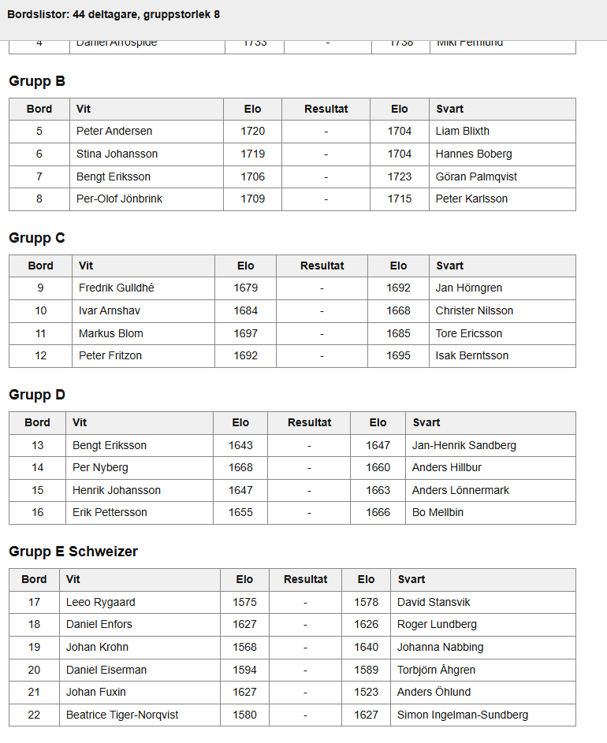

Detta bokmärke bryter ner en member-turnering till ett antal bergergrupper plus en schweizer i slutet vid behov.  
Avsikten med bokmärket är att snabbt komma igång med första ronden.  
När första ronden kommit igång skapar man grupperna för hand i medlemssystemet.  

Skapa ett bokmärke

* Lägg in namnet `BBS` (Berger + Berger + Schweizer)
* Lägg in följande kod: `javascript:(()=>{const s=document.createElement('script');s.src='https://christernilsson.github.io/2026/119-BBS/sketch.js';document.head.appendChild(s)})()`

Styr gruppstorleken genom att lägga t ex lägga in `&n=8` i slutet av urlen.

Exempel: `https://member.schack.se/ShowTournamentServlet?id=16696&hideclasses=true&n=8`

Utdataexempel:

